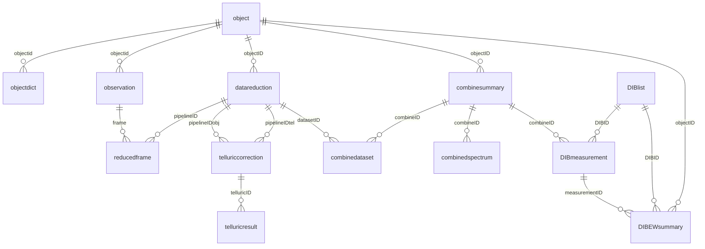

# DIBproject database notes

このメモは、`DIBproject` MySQL データベースの構造をコードと
`information_schema` から読み取ったものです。

## 接続

現状の接続口は `open_mysql_project.py` の `openproject()` です。

- host: `localhost`
- port: `3306`
- database: `DIBproject` / 実接続時は MySQL 側で `dibproject`
- MySQL version observed: `5.7.39`

注意: 接続情報がコードに直書きされているため、今後は環境変数や
ローカル設定ファイルへ移すのが安全です。

## 外部キー制約

MySQL の `information_schema.key_column_usage` 上では、外部キー制約は
定義されていません。

したがって、この DB は明示的な foreign key ではなく、カラム名の命名規約
とスクリプト内 SQL で関係を維持している構造です。

## テーブル群

確認できたテーブル:

- `ArtificialFeatures`
- `combinedataset`
- `combinedspectrum`
- `combinesummary`
- `datareduction`
- `datareduction_backup`
- `DIBEWsummary`
- `DIBlist`
- `DIBmeasurement`
- `object`
- `objectdict`
- `observation`
- `reducedframe`
- `reducedframe_backup`
- `StellarLine`
- `TABLE 2`
- `telluriccorrection`
- `telluricresult`
- `tmpobs`

## Approximate row counts

`information_schema.tables.table_rows` による概算です。InnoDB では正確な
`COUNT(*)` ではないため、集計結果と一致しない場合があります。

| Table | Approx. rows |
| --- | ---: |
| `ArtificialFeatures` | 23 |
| `combinedataset` | 204 |
| `combinedspectrum` | 2,972 |
| `combinesummary` | 142 |
| `datareduction` | 594 |
| `datareduction_backup` | 578 |
| `DIBEWsummary` | 17,286 |
| `DIBlist` | 667 |
| `DIBmeasurement` | 8,907 |
| `object` | 561 |
| `objectdict` | 783 |
| `observation` | 3,975 |
| `reducedframe` | 2,858 |
| `reducedframe_backup` | 2,719 |
| `StellarLine` | 815 |
| `TABLE 2` | 0 |
| `telluriccorrection` | 218 |
| `telluricresult` | 26,059 |
| `tmpobs` | 1 |

## Observed distributions

個別レコードではなく、カテゴリ・フラグの集計だけを確認したものです。

### Object types

| type | count |
| --- | ---: |
| `OBJECT` | 509 |
| `STANDARD` | 89 |

### Reduction modes

| mode | count |
| --- | ---: |
| `WIDE` | 603 |
| `HIRES-J` | 42 |
| `HIRES-Y` | 31 |
| empty string | 9 |

### DIB categories

| category | count |
| --- | ---: |
| `medium` | 469 |
| `weak` | 165 |
| `strong` | 18 |
| `fake` | 14 |
| `candidate` | 8 |
| `Cs I` | 3 |

### Combine status

| mode | telluricflag | combineflag | count |
| --- | ---: | ---: | ---: |
| `WIDE` | 1 | 0 | 134 |
| `WIDE` | 1 | 1 | 21 |
| `WIDE` | 0 | 0 | 5 |
| `HIRES-Y` | 1 | 0 | 1 |
| `HIRES-J` | 1 | 0 | 1 |

### Telluric correction status

| autoflag | advanced | mode | count |
| ---: | ---: | --- | ---: |
| 1 | 0 | `WIDE` | 126 |
| 1 | 1 | `WIDE` | 85 |
| 0 | 1 | `WIDE` | 26 |
| 0 | 0 | `WIDE` | 6 |
| 1 | 0 | `HIRES-J` | 1 |
| 1 | 0 | `HIRES-Y` | 1 |

## 推定リレーション

DB 制約ではなく、コードとカラム名から推定した関係です。

- Object master
  - `object.objectid`
  - `objectdict.objectid`
  - `observation.objectid`
  - `datareduction.objectID`
  - `combinesummary.objectID`
  - `DIBEWsummary.objectID`

- Observation and reduction
  - `observation.frame`
  - `reducedframe.objectframe`
  - `reducedframe.skyframe`
  - `datareduction.pipelineID`
  - `reducedframe.pipelineID`

- Telluric correction
  - `datareduction.pipelineID`
  - `telluriccorrection.pipelineIDobj`
  - `telluriccorrection.pipelineIDtel`
  - `telluriccorrection.telluricID`
  - `telluricresult.telluricID`

- Combined spectra
  - `combinesummary.combineID`
  - `combinedataset.combineID`
  - `combinedataset.datasetID`
  - `combinedspectrum.combineID`
  - `DIBmeasurement.combineID`

- DIB line definitions and measurements
  - `DIBlist.DIBID`
  - `DIBmeasurement.DIBID`
  - `DIBEWsummary.DIBID`
  - `DIBmeasurement.measurementID`
  - `DIBEWsummary.measurementID`

- Line lists
  - `StellarLine.lineID`
  - `ArtificialFeatures.AFID`

## Main workflow shape

大まかな処理の流れは次のように見えます。

1. `object` / `objectdict` に天体マスターを登録する。
2. `observation` に観測フレームを登録する。
3. `datareduction` / `reducedframe` に pipeline reduction 結果を登録する。
4. `telluriccorrection` / `telluricresult` に telluric 補正結果を登録する。
5. `combinesummary` / `combinedataset` / `combinedspectrum` に combine 済みスペクトルを登録する。
6. `DIBlist` を参照し、`DIBmeasurement` に DIB 測定結果を登録する。
7. 文献値や集計値は `DIBEWsummary` に入る。

## Tables most used by scripts

SQL 文字列から見ると、特に使用頻度が高いのは次のテーブルです。

- `object`
- `combinesummary`
- `DIBmeasurement`
- `datareduction`
- `telluriccorrection`
- `objectdict`
- `DIBlist`
- `combinedataset`
- `observation`
- `telluricresult`
- `reducedframe`
- `DIBEWsummary`
- `combinedspectrum`
- `StellarLine`

## Operational notes

- DB 側に foreign key がないので、削除・リネーム・ID 変更はコード側で関連
  テーブルをまとめて更新する必要があります。
- `change_object_name.py` は `combineID`, path, telluric path など複数テーブル
  を横断して更新するため、命名規約依存が強いスクリプトです。
- `DIBanalysis.py`, `combine_MySQL.py`, `telluric_auto.py`,
  `datadownload_merlot_ver*.py`, `object_add_mysql*.py` は DB へ INSERT/UPDATE
  する中心的なスクリプトです。
- 図作成・summary 系スクリプトも多くが DB を read するため、schema だけでなく
  解析対象の実データが必要です。
